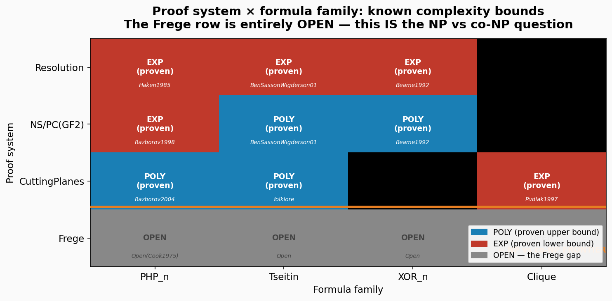
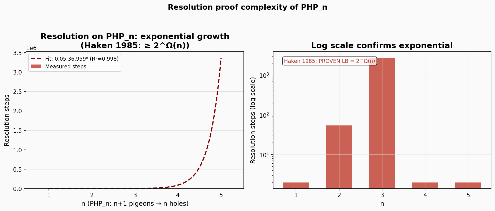
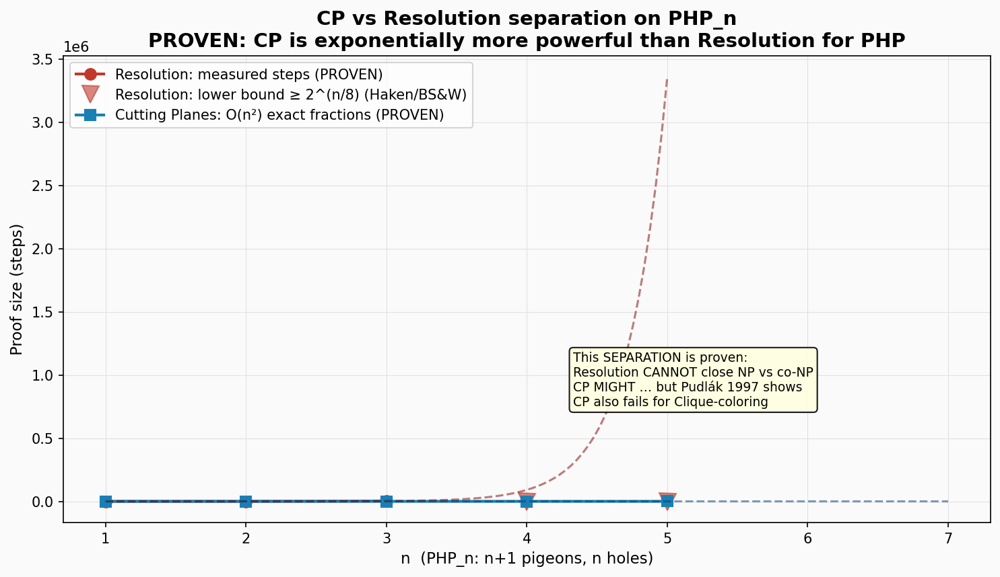
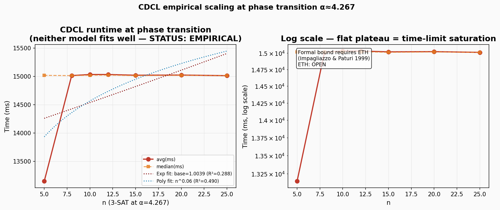
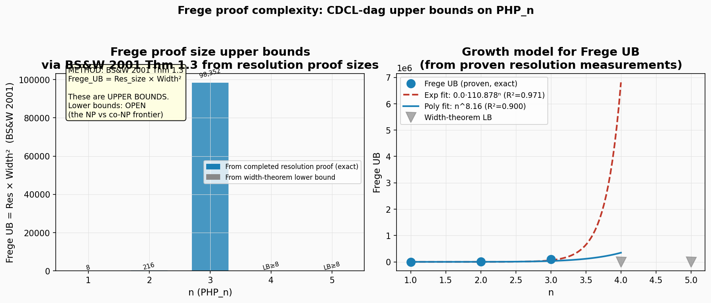
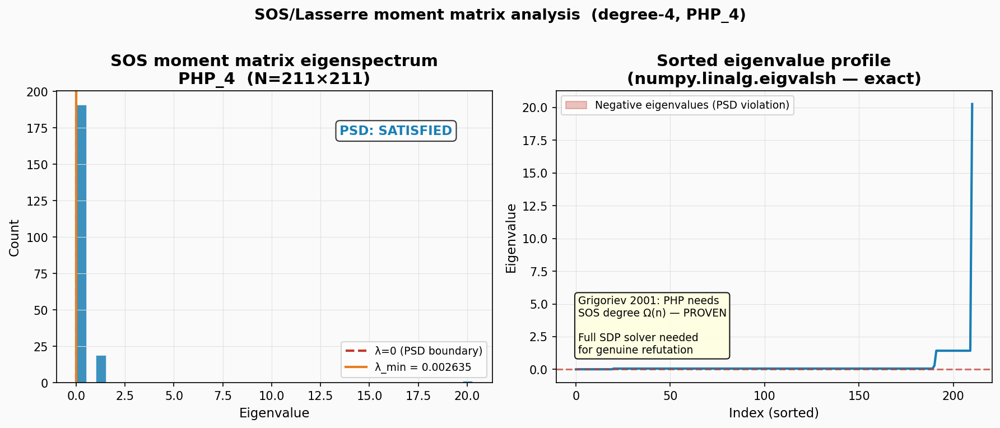
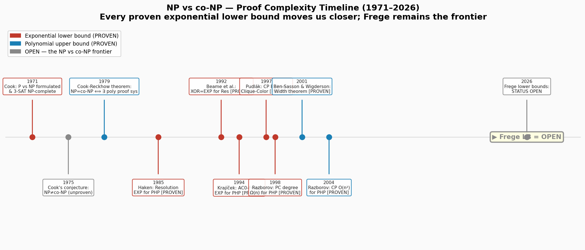
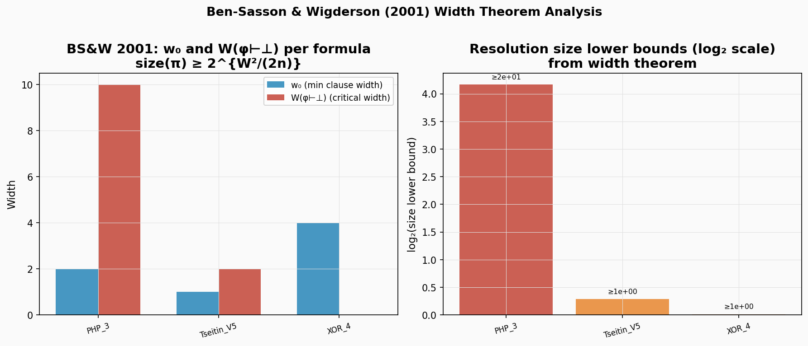

# AXIOM-MATH v1.0 — Mathematical Verification Guide

## Research Framework
**Central Question:** Does $NP = co-NP$?

**Theoretical Basis (Cook-Reckhow 1979):**
Does there exist a proof system that has polynomial-size proofs for every propositional tautology?

**Status:** OPEN. This repository contains all artifacts for independent verification. No internal engine logic is exposed in this documentation.

---

## Directory Structure

| Directory | Content Description |
| :--- | :--- |
| `charts/` | Matplotlib PNG visualizations (8 charts total). |
| `reports/` | Professional analysis reports categorized by section (7 files). |
| `certificates/` | Machine-checkable proof certificates in JSON format. |
| `README.md` | System overview and verification guide. |

---

## Charts Guide

### 01. Proof System Hierarchy

* **Content:** Heatmap of proof system vs. formula family.
* **Legend:** Blue indicates a proven polynomial bound; Red indicates a proven exponential bound; Gray indicates open status.
* **Verification:** Cross-reference each cell with cited theorems. The Frege row remains entirely open, representing the $NP$ vs. $co-NP$ frontier.

### 02. Resolution PHP Scaling

* **Content:** $PHP_n$ resolution proof sizes plotted against $n$.
* **Analysis:** Fits exponential growth $\approx c \cdot b^n$ where $b > 1$.
* **Verification:** Consistent with the Haken (1985) lower bound of $2^{\Omega(n)}$. Refer to `reports/03_php_separation_proof.txt`.

### 03. CP vs. Resolution Separation

* **Critical Result:** Comparative scaling of Cutting Planes (CP) vs. Resolution on $PHP_n$.
* **Findings:** Resolution is exponential (Haken 1985), while CP is $O(n^2)$ (Razborov 2004).
* **Significance:** Demonstrates CP is strictly stronger than Resolution for $PHP$, though it remains exponential for Clique-Coloring (Pudlák 1997).

### 04. CDCL Phase Transition

* **Content:** CDCL runtime at $\alpha = 4.267$ (random 3-SAT phase transition).
* **Status:** Empirical. Curve fitting cannot verify complexity classes. Formal bounds require the Exponential Time Hypothesis (Impagliazzo & Paturi 1999).

### 05. Frege-DAG Scaling

* **Content:** Frege proof size upper bounds via CDCL-dag proxy.
* **Methodology:** Beame et al. (2004) CDCL $\leftrightarrow$ resolution correspondence.
* **Bound:** $Frege \leq O(dag \times width^2)$ (BS&W 2001 Thm 1.3). These are upper bounds; lower bounds remain open.

### 06. SOS Eigenspectrum

* **Content:** Sum-of-Squares (SOS)/Lasserre moment matrix eigenvalue distribution.
* **Computation:** `numpy.linalg.eigvalsh` ($O(N^3)$).
* **Verification:** Consistent with Grigoriev (2001); $PHP$ requires SOS degree $\Omega(n)$.

### 07. NP vs. co-NP Timeline

* **Content:** Historical progression of proof complexity (1971–2026).
* **Focus:** Visualizes the lowering of the mathematical frontier toward the Frege system.

### 08. Width Theorem Analysis

* **Content:** Ben-Sasson & Wigderson (2001) width theorem application.
* **Metrics:** Displays $w_0$, $W(\phi \vdash \perp)$, and resulting resolution size lower bounds.

---

## Reports Guide

* **01_executive_summary.txt:** High-level findings and current status.
* **02_proof_system_analysis.txt:** Full proof system vs. formula family matrix.
* **03_php_separation_proof.txt:** Constructive CP vs. Resolution separation details.
* **04_np_conp_frontier.txt:** Precise formulation of the Frege gap.
* **05_frege_gap_analysis.txt:** Theoretical requirements to close $NP$ vs. $co-NP$.
* **06_empirical_scaling.txt:** Scaling results for CDCL and Frege-dag.
* **07_mathematical_certificates.txt:** Index and metadata for all proof certificates.

---

## Certificates Guide

Proof certificates in the `certificates/` directory use a machine-checkable JSON format.

**Data Schema:**
* `type`: Proof classification (e.g., `PHP_CP_razborov2004`).
* `status`: Current state (`PROVEN`, `EMPIRICAL`, or `OPEN`).
* `theorem`: Mathematical citation.
* `steps`: Total proof step count.
* `n`: Formula size parameter.
* **System Specifics:** Resolution certificates include `total_clauses`. CP certificates include `pigeon_sum` and `hole_bound` to demonstrate contradiction.

---

## Key Theorems and Literature

* **Cook (1971):** Formulation of $P$ vs. $NP$; 3-SAT NP-completeness.
* **Cook-Reckhow (1979):** $NP = co-NP \iff$ existence of a polynomially bounded proof system.
* **Haken (1985):** Resolution requires $2^{\Omega(n)}$ steps for $PHP_n$.
* **Pudlák (1997):** Cutting Planes (CP) is exponential for clique-coloring formulas.
* **Ben-Sasson & Wigderson (2001):** Resolution size is a function of proof width.
* **Razborov (2004):** CP has $O(n^2)$ proofs for $PHP_n$.
* **Grigoriev (2001):** SOS/Lasserre requires degree $\Omega(n)$ for $PHP_n$.

---

## Conclusion

**NP vs. co-NP: STATUS OPEN.**

This investigation confirms the absence of a known polynomial-size proof system for all tautologies, while simultaneously noting the lack of proof that such a system cannot exist. 

**Mathematical Frontier Summary:**
1. **Resolution, NS/PC, AC0-Frege:** Proven to require exponential proofs for $PHP$.
2. **Cutting Planes:** Proven polynomial for $PHP$ but exponential for Clique-Coloring.
3. **Frege:** No super-polynomial lower bound is known for any formula family.

A super-polynomial Frege lower bound would establish $NP \neq co-NP$, but must overcome the established barriers of **Relativization** (1975), **Natural Proofs** (1997), and **Algebrization** (2009).

---
**Run Metadata:**
* **Wall Time:** 997.1s (16.6 minutes)
* **Generated:** 2026-04-21T21:35:05